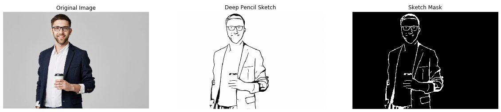
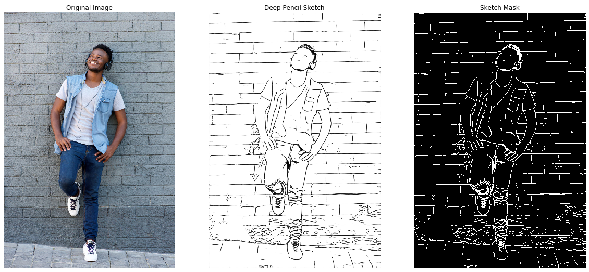
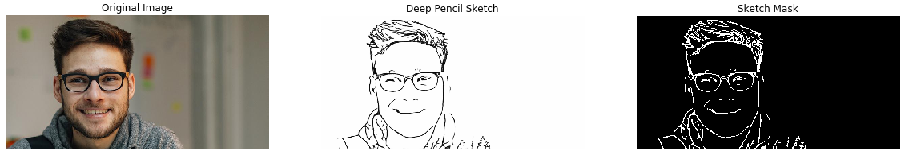
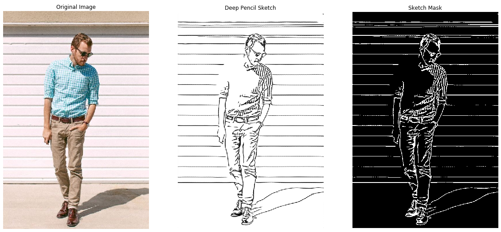
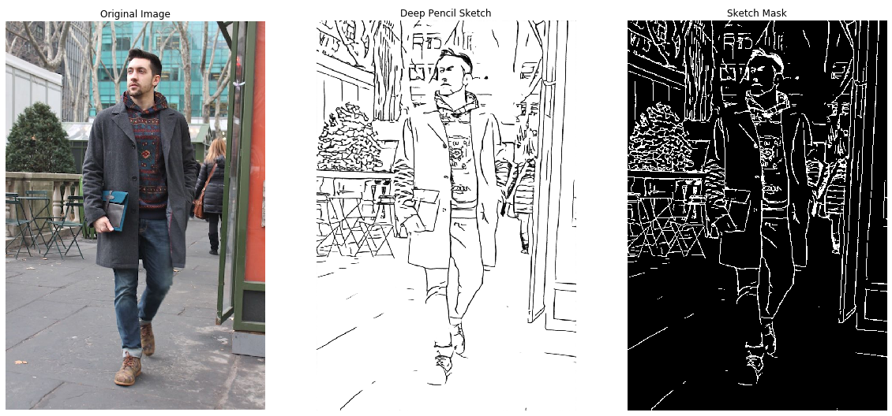

# Deep Pencil sketch

Convert images to look like as drawn by pencil using deep model.

For using deep model download the weights from drive and put files under folder named as ``./models/...`` 

Download from - [link](https://drive.google.com/drive/folders/1WZi5vQYggfki5eV0QWAbViVQYtzxetXS?usp=sharing)

Run the command to install requirements ``pip install -r requirements.txt``

Test model by running the file ``contours.py`` or add your images to ``./images`` folder and run the notebook ``results.ipynb`` 

Examples:

